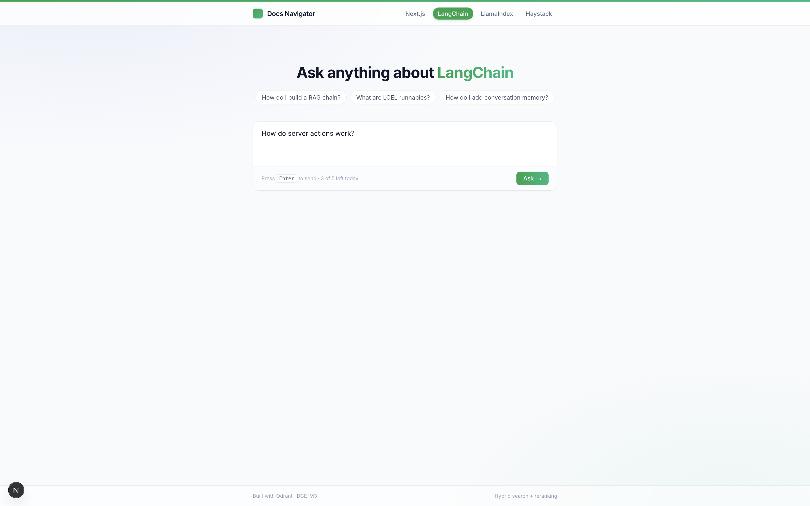
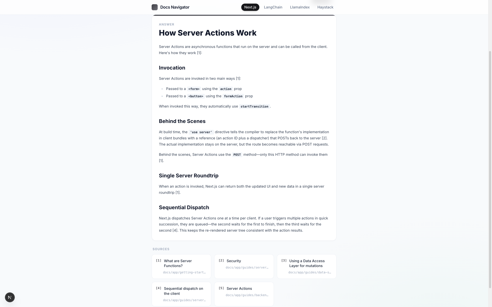

# Docs Navigator

RAG-powered Q&A over technical documentation. Ask a natural-language question, get a grounded answer with source citations — no hallucinated links.

**Live demo → [docs-navigator.onrender.com](https://docs-navigator.onrender.com)**

Covers four libraries: **Next.js · LangChain · LlamaIndex · Haystack**

---





---

## How it works

A user question goes through a four-stage pipeline:

```
Question
  │
  ▼
[1] BGE-M3 embedding          — dense (1024-dim) + learned sparse in one pass
  │
  ▼
[2] Hybrid retrieval (Qdrant)  — dense ANN + sparse search, fused with RRF
  │
  ▼
[3] Cross-encoder reranking    — bge-reranker-v2-m3 re-scores top-20 candidates
  │
  ▼
[4] Claude (Haiku) generation  — answer grounded in retrieved chunks, with citations
```

Documentation is ingested from GitHub at index time: fetched, cleaned, chunked, and stored in Qdrant as named vectors (`dense` + `sparse`) so both retrieval modes run against the same collection.

---

## Retrieval design & ablation

The retrieval pipeline went through several iterations, each motivated by a measured failure mode.

### Experiment results (Next.js eval set, 60 questions)

| Config | URL recall@1 | URL recall@3 | URL recall@5 | URL MRR | Strict recall@3 | Strict MRR |
|---|---|---|---|---|---|---|
| Dense only (baseline) | 0.567 | 0.750 | 0.850 | 0.672 | 0.583 | 0.522 |
| + BM25 hybrid | 0.533 | 0.733 | 0.833 | 0.649 | 0.567 | 0.469 |
| + BGE-M3 hybrid | 0.583 | 0.767 | 0.850 | 0.679 | 0.617 | 0.495 |
| + Reranker (bge-base) | 0.533 | 0.733 | 0.850 | 0.648 | 0.533 | 0.500 |
| + Reranker (v2-m3) | 0.583 | 0.850 | 0.900 | 0.711 | 0.717 | 0.574 |
| **Hybrid + Reranker (v2-m3)** | **0.583** | **0.883** | **0.900** | **0.717** | **0.733** | **0.582** |

**Hybrid+Rerank (v2-m3) wins or ties on every metric.**

### What the numbers revealed

**BM25 hybrid hurt retrieval.** Adding BM25 alongside dense search *lowered* recall across the board. Diagnosis: BM25 filters common words as stopwords, but technical queries are dense with tokens like `"use"`, `"get"`, `"server"` that carry real meaning in a framework context. The sparse signal was too noisy to help.

**BGE-M3's learned sparse fixed this.** BGE-M3 produces its own sparse lexical weights as a byproduct of encoding — no stopword filtering, weights learned end-to-end from the training data. Switching to it recovered the recall drop and slightly exceeded the dense baseline, with zero additional RAM since the same model run was already happening.

**The base reranker barely moved the needle.** `bge-reranker-base` is trained on MS MARCO (web search). Technical documentation is a different domain — it struggled to distinguish a relevant API reference from a loosely related tutorial.

**`bge-reranker-v2-m3` drove the biggest single jump.** Same model family as BGE-M3, trained on the same data distribution. Strict recall@3 went from 0.617 → 0.733 (+18.8%) and URL recall@3 from 0.767 → 0.883 (+15.1%) in one swap. The lesson: model family coherence matters more than reranker size.

---

## Stack

| Layer | Technology |
|---|---|
| Embeddings | [BAAI/bge-m3](https://huggingface.co/BAAI/bge-m3) — dense + learned sparse |
| Reranker | [BAAI/bge-reranker-v2-m3](https://huggingface.co/BAAI/bge-reranker-v2-m3) |
| Vector DB | [Qdrant Cloud](https://qdrant.tech) — named vectors, RRF fusion |
| LLM | Claude Haiku (Anthropic) |
| Backend | FastAPI + Python 3.12 |
| Frontend | Next.js 15 (App Router) |
| Deployment | Render (single Web Service — Next.js proxies to FastAPI internally) |

---

## Project structure

```
docs-navigator/
├── app/
│   ├── api/routes.py          # /query endpoint
│   ├── core/config.py         # settings (USE_HYBRID, USE_RERANKER, etc.)
│   └── services/
│       ├── retriever.py       # hybrid search + rerank orchestration
│       └── reranker.py        # cross-encoder reranking
├── ingestion/
│   ├── fetcher.py             # GitHub tree API → cleaned markdown
│   ├── chunker.py             # sliding window chunker
│   ├── embedder.py            # BGE-M3 dense + sparse embeddings
│   ├── store.py               # Qdrant upsert (named vectors)
│   └── libraries.py           # per-library config (repo, path, branch)
├── frontend/                  # Next.js app
├── eval/                      # evaluation harness + results
├── Dockerfile                 # multi-stage: Node build → Python runtime
└── render.yaml                # Render deploy config
```

---

## Running locally

**Prerequisites:** Python 3.12+, Node 20+, a running Qdrant instance ([Docker](https://qdrant.tech/documentation/quick-start/) or Qdrant Cloud)

```bash
# 1. Clone and install
git clone https://github.com/kylemtan/docs-navigator
cd docs-navigator
pip install -r requirements.txt

# 2. Set environment variables
cp .env.example .env
# Fill in: ANTHROPIC_API_KEY, QDRANT_URL, QDRANT_API_KEY

# 3. Ingest a library (Next.js shown — takes ~2 min)
python -m ingestion.ingest --library nextjs

# 4. Start the backend
uvicorn app.main:app --reload

# 5. Start the frontend
cd frontend && npm install && npm run dev
```

The app will be at `http://localhost:3000`. The frontend proxies `/api/*` to FastAPI on `:8000`.

**Config toggles** (in `.env`):
```
USE_HYBRID=true       # BGE-M3 sparse + dense with RRF
USE_RERANKER=true     # bge-reranker-v2-m3 cross-encoder (needs ~1.1 GB RAM)
```

---

## Evaluation

The eval harness (`eval/run_eval.py`) measures retrieval and generation quality against a hand-labelled question set:

- **URL recall@k** — does the correct doc page appear in the top-k retrieved chunks?
- **Strict recall@k** — does the correct *section* of that page appear?
- **MRR** — mean reciprocal rank of the first correct result
- **Faithfulness** — Claude grades whether the answer is grounded in the retrieved context

```bash
python eval/run_eval.py --eval-file eval/nextjs_eval.json --library nextjs
```
